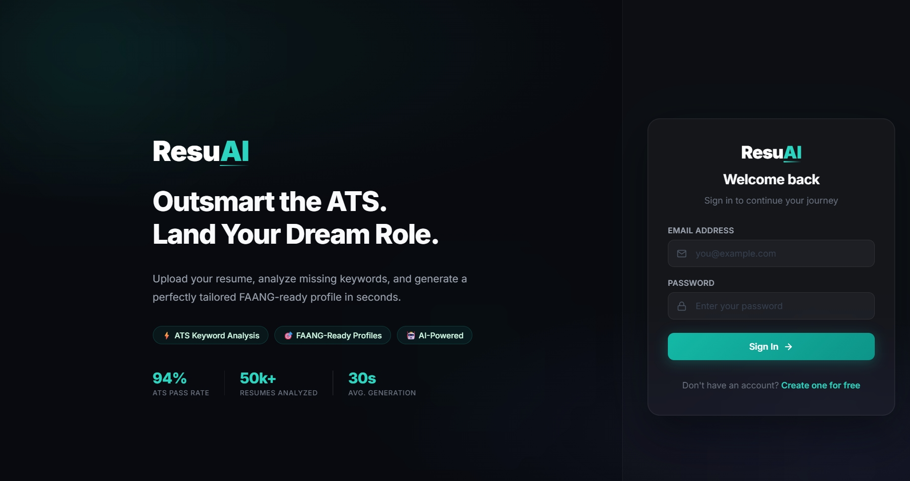
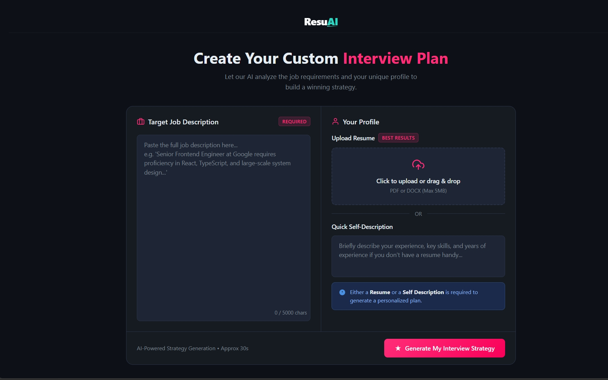
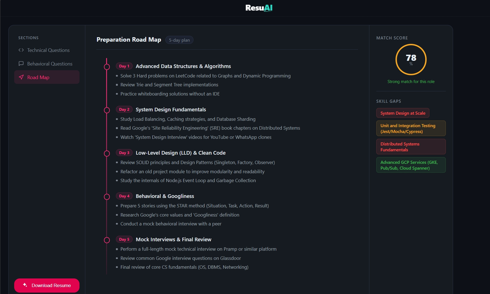

# ResuAI: Enterprise ATS Analytics & Profile Optimization Engine

ResuAI (formerly ATS Resume Analyzer) is a production-grade, deterministic profile optimization engine. Leveraging the advanced contextual capabilities of Google Gemini, ResuAI dynamically ingests unstructured, non-standardized candidate profiles (PDF/DOCX) and strictly parses them into deterministic, highly structured JSON payloads. This ensures guaranteed ATS (Applicant Tracking System) keyword alignment, enabling rapid synthesis of FAANG-spec profiles with zero-disk-write buffer streaming for optimal backend performance.

### 📸 Application Interface & System Flow
| Home Portal | Analysis Planner | Results Dashboard |
|:---:|:---:|:---:|
|  |  |  |

---

## 🏗️ Core Architectural Focus

Our architecture prioritizes deterministic execution, robust security postures, and memory-efficient I/O handling:

- **Enforcing Structured LLM Output Profiles**: We enforce strict schema validation via **Zod schemas**. The integration with Google Gemini is highly constrained to guarantee that unstructured outputs are coalesced into predictable, deeply nested JSON objects, preventing runtime hydration errors on the client.
- **Mitigating XSS/CSRF Vectors**: The authentication transport layer is fortified using **HttpOnly, Secure, and SameSite stateful cookie session management**. This effectively neutralizes cross-site scripting (XSS) payload execution and cross-site request forgery (CSRF) attempts.
- **Memory-Efficient Backend Pipelines**: We implement **zero-disk-write buffer streaming** using `multer` memory storage. Files are directly piped from the client request stream into the processing engine without touching the server's disk, minimizing I/O blocking operations.

---

## 📸 Screenshots

The interface mockups are referenced below and can be updated directly in the `./screenshots/` directory:

### 🏠 Home Page
*Path: `./screenshots/home.png`*

*Provides access to target job descriptions, resume upload dropzones, and recent analysis history.*

### 📋 Analysis Planner
*Path: `./screenshots/planner.png`*

*Organizes raw candidate structures and schedules study routines tailored to specific role requirements.*

### 📊 Results Dashboard
*Path: `./screenshots/result.png`*

*Renders detailed skill gaps, ATS matching indexes, and custom-generated study answers.*

---

## ⚙️ Key Features & System Workflow

- **Algorithmic Optimization Engine**: Dynamically compares the deterministic structural output of the candidate's resume against targeted Job Description parameters.
- **Missing Keyword Mapping Algorithms**: Executes a high-speed diffing process to identify technical gaps, severity indexing (High, Medium, Low), and exact keyword omissions preventing ATS shortlisting.
- **Tailored Asset Delivery Templates**: Generates on-the-fly, personalized preparation roadmaps and technical/behavioral question datasets, delivered via optimized JSON streams.

---

## 📂 Folder Structure Map

```text
ATSFreak/
├── Backend/
│   ├── src/
│   │   ├── config/            # Database and Environment configurations
│   │   ├── controllers/       # Route handling and request orchestration
│   │   ├── middlewares/       # Auth guards and schema validation pipelines
│   │   ├── models/            # Mongoose ODM schemas
│   │   ├── routes/            # API endpoint definitions
│   │   ├── services/          # Business logic and AI integrations (Gemini)
│   │   └── app.js             # Express application instantiation
│   ├── server.js              # Entry point and server cluster binding
│   └── package.json           # Backend dependency manifests
│
├── Frontend/
│   ├── src/
│   │   ├── features/          # Domain-driven feature modules (auth, interview)
│   │   ├── style/             # Global SCSS architectural styles
│   │   ├── App.jsx            # React root layout component
│   │   ├── app.routes.jsx     # Client-side routing definitions
│   │   └── main.jsx           # DOM mounting and provider injections
│   ├── index.html             # Entry HTML document
│   └── package.json           # Frontend dependency manifests
│
└── screenshots/               # Application flow visual assets
    ├── home.png               # Home dashboard view
    ├── planner.png            # Preparation plan / scheduler view
    └── result.png             # Analysis and results dashboard view
```

---

## 📡 API Endpoint Reference

| Method | Endpoint | Payload / Params | Architectural Optimization |
|:---:|:---|:---|:---|
| `POST` | `/api/auth/register` | `{ email, password, username }` | BCrypt salting & hashing offloaded from the main thread where possible. |
| `POST` | `/api/auth/login` | `{ email, password }` | Issues HttpOnly JWTs directly via Set-Cookie headers. |
| `POST` | `/api/auth/logout` | `None` | Immediate cookie invalidation. |
| `POST` | `/api/interview/generate` | `FormData { jobDescription, resumeFile }` | Streams multipart form data directly into memory buffers; bypasses disk writes. |
| `GET` | `/api/interview/:id` | `Params: { id }` | Retrieves pre-computed structural analysis. |
| `GET` | `/api/interview/` | `None` | Omitting heavy nested payloads (like the raw generated text) on index queries to lower network latency. Returns summarized lists. |

---

## ⚠️ Current Limitations

1. **Token Exhaustion Risk**: Generating massive formatting templates directly from the LLM impacts API budgets significantly and increases request latency. Relying on the LLM for heavy markdown/HTML structuring is inefficient.
2. **Mobile Cross-Origin Mismatch**: Strict Intelligent Tracking Prevention (ITP flags) in mobile viewports drops secure cross-domain session handling. Cross-origin cookie policies often break authentication flows on Safari iOS.
3. **Rate Limiting Vulnerabilities**: The lack of distributed API throttling mechanisms makes the endpoints susceptible to automated payload spamming, potentially exhausting backend resources rapidly.

---

## 🚀 Future Scalability Roadmap

To transition this architecture to handle true enterprise scale, the following system upgrades are planned:

- **Asynchronous Message Queues**: Implementing **BullMQ & Redis** to handle intense computing operations gracefully. The file processing and LLM generation will be offloaded to worker nodes, providing immediate 202 Accepted responses to the client.
- **Decoupling Rendering Concerns**: Shifting away from LLM-generated formatting to **local Handlebars / EJS templates**. The LLM will only return raw JSON data, which will then be parsed locally, cutting token consumption by over 90%.
- **Redis Caching Layer**: Establishing a central **Redis Caching Layer** for redundant structural lookups and session management to drastically reduce MongoDB database load and query latency.
- **Reverse Proxy Architecture**: Setting up a **Reverse Proxy / Vercel Rewrites** architecture to unify cross-origin assets into a single First-Party domain context, bypassing mobile ITP restrictions and CORS complexities entirely.
